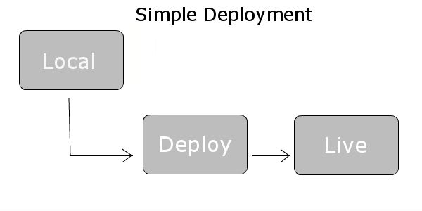

# bash-simple-deployment
Simple bash deployment script for basic web projects.

## Features
* checkout from Git or Github
* can replace active version in file
* install and update composer
* start phing deployment
* set custom permission on folders
* create symlinks from current rls to web folder
* clear cache folders

## Required

* bash, git, php, rsync or scp
* Deploy Server
* Target Server

## Required directory structure

To make the deploy process simple as possible i recommend this directory structure on your server.

* Deploy Server
    * /path/to/bash-simple-deployment

* Web Server (Target)
    * /var/www/project
        * /active - symlink to newest release
        * /releases - all deployed releases
            * /X.X.X - Releases

## Before you start

Modify the config values in /config/****.sh to your needs. Change your webserver config and modify the path to the 
"active" directory. The active directory link to your active public index.

## Run deployment

Make it executable and then start the script.

    chmod +x run.sh
    ./run.sh